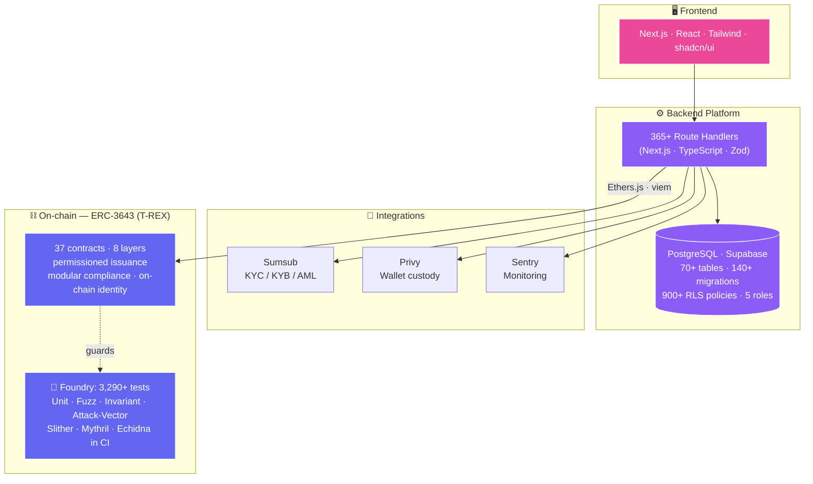

<!-- <h1 align="center">
   
  Hi, I'm Vidit Kulshrestha! 
  
</h1>

<p align="center">
  
</p>

<div align="center">
  
  
  
  
  
</div>

<p align="center">
  
</p>

## 🚀 About Me


- 🎓 **Computer Science enthusiast** with a passion for coding and problem-solving
- 🌱 Currently exploring **Web3 technologies** and diving into **Machine Learning & AI**
- � **Tech Problem Solver** - Give me any tech challenge, I'll find a solution!
- 🔭 Working on exciting **blockchain** and **full-stack** projects
- 🎯 Goal: Contributing to **open-source** and building impactful applications
- ⚡ Fun fact: I believe every bug is just an undiscovered feature! 😄

<br clear="both">

---


## �️ Tech Stack & Skills

<div align="center">

### 💻 Programming Languages
<p>
  
  
  
  
</p>

### 🎨 Frontend Development
<p>
  
  
  
  
</p>

### ⚙️ Backend Development
<p>
  
  
</p>

### 🤖 AI/ML & Data Science
<p>
  
  
  
  
</p>

### ⛓️ Blockchain & Web3
<p>
  
  
  
</p>

### 🛠️ Tools & Platforms
<p>
  
  
  
  
  
</p>

</div>

---


## 📊 GitHub Analytics

<div align="center">
  
  
  
  
</div>

<div align="center">
  
</div>

<div align="center">
  
</div>

---

## 🌟 Featured Projects

### [SathiSahyogi](https://github.com/viditkulsh/SathiSahyogi)
A decentralized crowdfunding platform built to facilitate fundraising for charitable causes. This platform leverages blockchain technology to ensure transparency and security in transactions. The project includes a smart contract deployed on the Ethereum network, with a frontend built using Next.js and Tailwind CSS.

### [Mood_Dapp_myFirstDapp](https://github.com/viditkulsh/Mood_Dapp_myFirstDapp)
An introductory decentralized application (dApp) that allows users to interact with an Ethereum smart contract to set and get a mood. This project uses Solidity for the smart contract and HTML, CSS, and JavaScript for the frontend. It's a great example of how blockchain can be integrated into everyday applications.

### [Aventura-De-Texto](https://github.com/viditkulsh/Aventura-De-Texto)
A text-based adventure game developed as a group project. This game engages readers with an interactive storyline where the plot evolves based on the choices made by the player. It’s entirely coded in Python and showcases the power of text-based interfaces in creating engaging user experiences.


## 🏆 GitHub Trophies

<div align="center">
  
</div>

---

## 🤝 Let's Connect!

<div align="center">

### � **Reach out to me:**

[](mailto:viditkulsh.work@gmail.com)
[](https://linkedin.com/in/vidit-kulshrestha/)
[](https://twitter.com/vidit_kulsh)
[](https://instagram.com/vidit_kulshrestha)
[](https://medium.com/@viditkul08)

### 💻 **Coding Profiles:**

[](https://www.leetcode.com/viditkul08)
[](https://www.codechef.com/users/viditkul08)
[](https://github.com/viditkulsh)

</div>

<div align="center">
  
  **💡 Open to collaborations • 🚀 Always learning • 🎯 Building the future**
  
  *Thanks for visiting my profile! Feel free to reach out for collaborations or just a tech chat!* 😄
  
</div>

 -->


<!--
  ╔══════════════════════════════════════════════════════════════════╗
  ║  VIDIT KULSHRESTHA · Web3 Full-Stack Engineer                      ║
  ║  Animated profile README — mirrors cv.pdf in this repo            ║
  ╚══════════════════════════════════════════════════════════════════╝
-->

<!-- ░░░░░░░░░░░░░░░░  ANIMATED HEADER (theme-adaptive)  ░░░░░░░░░░░░░░░░ -->
<p align="center">
  <picture>
    <source media="(prefers-color-scheme: dark)" srcset="https://capsule-render.vercel.app/api?type=waving&color=0:312E81,50:6D28D9,100:9D174D&height=220&section=header&text=Vidit%20Kulshrestha&fontSize=48&fontColor=ffffff&animation=fadeIn&fontAlignY=38&desc=Web3%20Full-Stack%20Engineer%20·%20Smart%20Contracts%20·%20Backend%20%2F%20Platform&descAlignY=58&descSize=18"/>
    
  </picture>
</p>

<!-- ░░░░░░░░░░░░░░░░  TYPING SUBTITLE  ░░░░░░░░░░░░░░░░ -->
<p align="center">
  <a href="https://dev-vidit.vercel.app">
    
  </a>
</p>

<!-- ░░░░░░░░░░░░░░░░  CONTACT / SOCIAL BADGES  ░░░░░░░░░░░░░░░░ -->
<p align="center">
  <a href="https://dev-vidit.vercel.app"></a>
  <a href="https://linkedin.com/in/vidit-kulshrestha"></a>
  <a href="https://github.com/viditkulsh"></a>
  <a href="mailto:viditkulsh.work@gmail.com"></a>
</p>

<p align="center">
  
  
  
  
</p>

---

## 🧬 whoami

```ts
const vidit = {
  role: "Web3 Full-Stack Engineer",
  focus: ["Smart Contracts (Solidity)", "Backend / Platform"],
  currently: "Assistant Manager IT — Web3 @ AGP",
  building: "Regulated Real-World-Asset (RWA) tokenization, end-to-end",
  stack: ["Solidity", "Foundry", "Next.js", "TypeScript", "Supabase", "viem"],
  obsession: "security-first delivery · RBAC · audit-driven everything",
  research: ["cross-chain interoperability", "validator security"],
  ielts: "7.0 (C1)",
};
```

> Web3 full-stack engineer shipping **ERC-3643 (T-REX)** smart contracts, cross-chain PoCs, and
> production backend platforms for **regulated RWA tokenization**. Security-first across the stack —
> from Foundry fuzz/invariant suites to Row-Level-Security'd Postgres.

<!-- ░░░░░░░░░░░░░░░░  AUTO-REFRESHING DEV QUOTE  ░░░░░░░░░░░░░░░░ -->
<p align="center">
  
</p>

---

## 📊 by the numbers — current platform

<table align="center">
<tr>
  <td align="center"><h2>365+</h2>REST API<br/>route handlers</td>
  <td align="center"><h2>900+</h2>Row-Level<br/>Security policies</td>
  <td align="center"><h2>70+</h2>Postgres tables<br/>140+ migrations</td>
</tr>
<tr>
  <td align="center"><h2>3,290+</h2>Foundry tests<br/>138 test files</td>
  <td align="center"><h2>37</h2>ERC-3643 contracts<br/>across 8 layers</td>
  <td align="center"><h2>19</h2>audit findings<br/>remediated</td>
</tr>
</table>

---

## 🛠️ arsenal


**⛓️ Blockchain**


`ERC-3643 (T-REX)` `ERC-20` `DeFi` `WalletConnect`

**🧩 Backend & Frontend**


**🗄️ Data · 🔐 Security · ⚙️ DevOps**


`Slither` `Mythril` `Echidna` `RBAC` `RLS` `Sumsub KYC/AML`

---

## 🏛️ RWA tokenization platform — how it fits together



---

## 💼 experience — `git log --author="vidit"`

<details open>
<summary><b>🟣 Assistant Manager IT, Web3 — AGP</b> · <i>Remote, India · Dec 2025 → Present</i></summary>

<br/>

- Engineer a regulated **RWA tokenization platform** end-to-end — smart contracts, backend, and the full asset lifecycle (issuance, governance, corporate actions, redemption).
- Built & maintain **365+ REST API route handlers** on **Next.js · TypeScript · PostgreSQL · Supabase** powering onboarding, KYC/KYB, compliance, transactions, and governance.
- Architected the data layer: **70+ tables**, **140+ migrations**, **900+ RLS policies**, RBAC across **5 user roles**.
- Implemented **ERC-3643 (T-REX)** security tokens (**37 production contracts, 8 layers**) deployed on an EVM network via **Ethers.js & viem**.
- Authored a **3,290+ test Foundry suite** (**138 files**) — Unit · Fuzz · Invariant · RBAC · Integration · Attack-Vector · State-Machine — with **Slither, Mythril, Echidna** in CI.
- Integrated **Sumsub** (KYC/AML), **Privy** (custody), **Sentry** (monitoring); led technical due diligence across identity/compliance/custody/blockchain vendors.
- Drove audit-driven delivery — remediated **19 internal security findings** (2 critical, 4 high), hardening access control, audit logging, and business-rule validation.

</details>

<details>
<summary><b>🔵 Blockchain Developer Intern — Astraeus Next Gen</b> · <i>Remote · Dec 2024 → Apr 2025</i></summary>

<br/>

- Built & tested **proof-of-concept cross-chain bridges** with Node.js, Solidity, Hardhat, Ethers.js.
- Maintained **90%+ test coverage**; peer code reviews following Agile best practices.
- Created reusable deployment scripts and internal docs to streamline onboarding.

</details>

<details>
<summary><b>🟢 Blockchain Research Intern — DRDO</b> · <i>Delhi · Jan 2025 → May 2025</i></summary>

<br/>

- Researched **trustless cross-chain communication** with focus on secure asset transfer across EVM networks.
- Produced technical diagrams & structured docs supporting research proposals and publication prep.
- Collaborated with an interdisciplinary team to evaluate interoperability and define security standards.

</details>

---

## 🚀 featured projects

<table>
<tr>
<td width="50%" valign="top">

### 🏷️ [IditTrack](https://github.com/viditkulsh/IditTrack)
**Micro-SaaS Inventory & Order Mgmt** · `Jul–Aug 2025`

Multi-tenant SaaS (React · TS · Supabase) with **RLS-isolated** tenant data, role-based workflows (Admin/Manager/User), CSV bulk import, real-time multi-location tracking, analytics dashboard + **PWA offline**.

`React` `TypeScript` `Supabase` `RLS` `PWA`

</td>
<td width="50%" valign="top">

### 🩸 [HemoChain](https://github.com/viditkulsh/HemoChain)
**Ethereum Blood Donation System** · `Jul–Dec 2024`

Solidity contracts for donor-recipient matching & on-chain records. React + **MetaMask** auth cut failed submissions **~25%**. Records on **IPFS** with on-chain hashed pointers.

`Solidity` `React` `IPFS` `MetaMask`

</td>
</tr>
<tr>
<td width="50%" valign="top">

### 🤝 [SathiSahyogi](https://github.com/viditkulsh/SathiSahyogi)
**Charity Crowdfunding on Ethereum** · `Feb–May 2024`

Solidity escrow with **milestone-based releases**. React + Tailwind + MetaMask donations. Hardhat/Ethers.js automation targeting **~80%+ coverage**.

`Solidity` `Hardhat` `React` `Tailwind`

</td>
<td width="50%" valign="top">

### ⛽ [L2 Gas Comparison](https://github.com/viditkulsh/gas_comparison)
**Real-time Multi-chain Gas Tracker** · `2024`

Next.js + TS dashboard polling live gas across **L1, Arbitrum, Optimism, Base, zkSync, StarkNet**. Tx-cost analyzer, ETH/USD/INR conversion, Recharts viz.

`Next.js` `TypeScript` `Ethers.js v6`

</td>
</tr>
</table>

---

## 🎓 education · 🔬 research · 📜 certs

<table>
<tr><td valign="top" width="50%">

**🎓 Bennett University**
B.C.A. (Honours) · `Sep 2022 – Jul 2025`
**CGPA 8.78/10** · SGPA peaks 9.48 & 9.2
Capstone: Blockchain interoperability (DRDO × Astraeus)
*Algorithms · OS · OOP · Blockchain · Cryptography · DBMS · Distributed Systems*

**🔬 Research**
- Trustless interoperability & cross-chain transfer — *validator security + latency*
- Decentralized info-mgmt for healthcare supply chains *(ongoing)*

</td><td valign="top" width="50%">

**📜 Certifications** — *Coursera*
- Blockchain Basics — *Buffalo* · [`R4JUF8CEGFE5`](https://coursera.org/verify/R4JUF8CEGFE5)
- Smart Contracts — *Buffalo* · [`W4N5JM7YVYNU`](https://coursera.org/verify/W4N5JM7YVYNU)
- Blockchain Platforms — *Buffalo* · [`LLQ33LSJH7UQ`](https://coursera.org/verify/LLQ33LSJH7UQ)
- DApp Development — *SUNY* · [`VFABPJNPGS6E`](https://coursera.org/verify/VFABPJNPGS6E)
- Cryptography — *Stanford* · [`0WQ67B639L8N`](https://coursera.org/verify/0WQ67B639L8N)

**🏆 Hackathons & Community**
- EDU Chain — NFT academic credential verifier
- HacknChill 2024 — on-chain event ticketing
- Volunteer · Bharat Blockchain Yatra 2024

</td></tr>
</table>

---

## 📈 github stats

<p align="center">
  
  
</p>

<p align="center">
  
</p>

<!-- ░░░░░░░░░░░░  METRICS CARDS (generated by .github/workflows/metrics.yml — needs METRICS_TOKEN secret)  ░░░░░░░░░░░░ -->
<p align="center">
  
</p>
<p align="center">
  
</p>

<p align="center">
  
</p>

### ⏱️ Weekly coding breakdown
<!-- waka.yml replaces everything between these markers each day -->
<!--START_SECTION:waka-->
> _WakaTime stats appear here after the first `⏱️ WakaTime Readme Stats` workflow run. Set up `WAKATIME_API_KEY` + `GH_TOKEN` secrets and install the WakaTime editor plugin to start tracking._
<!--END_SECTION:waka-->

<!-- ░░░░░░░░░░░░░░░░  ANIMATED ACTIVITY GRAPH  ░░░░░░░░░░░░░░░░ -->
<p align="center">
  
</p>

<!-- ░░░░░░░░░░░░░░░░  3D CONTRIBUTION CALENDAR (generated by .github/workflows/3d-contrib.yml)  ░░░░░░░░░░░░░░░░ -->
<p align="center">
  
</p>

<!-- ░░░░░░░░░░░░░░░░  CONTRIBUTION SNAKE (generated by .github/workflows/snake.yml → output branch)  ░░░░░░░░░░░░░░░░ -->
<p align="center">
  <picture>
    <source media="(prefers-color-scheme: dark)" srcset="https://raw.githubusercontent.com/viditkulsh/Vidit_Kulsh_CV/output/snake-dark.svg"/>
    <source media="(prefers-color-scheme: light)" srcset="https://raw.githubusercontent.com/viditkulsh/Vidit_Kulsh_CV/output/snake.svg"/>
    
  </picture>
</p>

---

<p align="center">
  
</p>

<p align="center"><i>English (IELTS Academic 7.0, C1) · Open to relocation — Germany · UAE · Europe · Remote</i></p>
