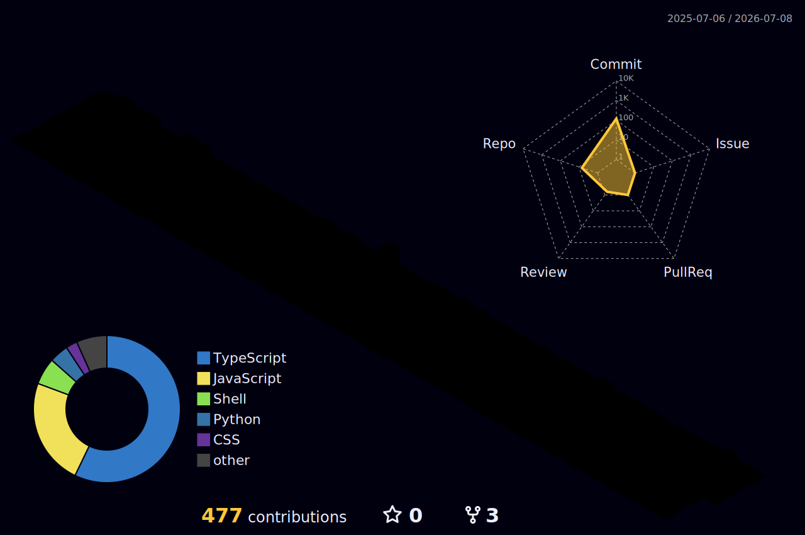

<!--
  ╔══════════════════════════════════════════════════════════════════╗
  ║  VIDIT KULSHRESTHA · Full-Stack Blockchain Developer               ║
  ║  GitHub profile README                                            ║
  ╚══════════════════════════════════════════════════════════════════╝
-->

<!-- ░░░░░░░░░░  HERO — animated header (theme-adaptive)  ░░░░░░░░░░ -->
<p align="center">
  <picture>
    <source media="(prefers-color-scheme: dark)" srcset="https://capsule-render.vercel.app/api?type=waving&color=0:0F172A,50:312E81,100:6D28D9&height=220&section=header&text=Vidit%20Kulshrestha&fontSize=46&fontColor=ffffff&animation=fadeIn&fontAlignY=38&desc=Full-Stack%20Blockchain%20Developer%20·%20Zero%20to%20One&descAlignY=58&descSize=18"/>
    
  </picture>
</p>

<p align="center">
  <a href="https://dev-vidit.vercel.app">
    
  </a>
</p>

<p align="center">
  <a href="https://dev-vidit.vercel.app"></a>
  <a href="https://linkedin.com/in/vidit-kulshrestha"></a>
  <a href="mailto:viditkulsh.work@gmail.com"></a>
</p>

<p align="center">
  
  
  
</p>

<br/>

## 👋 About


I'm a full-stack blockchain developer, and my favorite thing to do is take a product from **zero to one** — from "here's the problem" to something real, secure, and running in production.

Writing code is honestly the smallest part of that. The fun part is understanding the product, the architecture, the business rules, the compliance traps, and the human on the other end of the screen — then making it all click together. When I join a project, I get invested in whether it *succeeds*, not just whether my tickets close. Which usually means fixing things nobody asked me to fix. I have made peace with this about myself.

Best systems I've shipped came out of good conversations with product, design, compliance, and QA — not lone-wolf commits at 2am.

<br clear="both"/>

```text
blockchain · web3 · distributed systems · AI · backend systems
product architecture · fintech · tokenization · smart contracts · cloud
```

<br/>

## 🔭 Current focus

- **Security-first smart-contract engineering** — Solidity with Foundry test suites (unit · fuzz · invariant · attack-vector), backed by Slither / Mythril / Echidna in CI
- **Production backends for on-chain products** — Next.js · TypeScript · PostgreSQL · Supabase, with role-based access control and Row-Level Security as defaults, not afterthoughts
- **Tokenization & FinTech rails** — where compliance and audit logging are part of the architecture, not a bolt-on
- **Research** — trustless cross-chain interoperability and validator security

<br/>

## 🛠️ Tech stack

<div align="center">

**Languages**


**Web & Backend**


**Data & Infrastructure**


**Blockchain tooling**


</div>

<br/>

## 💼 Experience

<details open>
<summary><b>Web3 Full-Stack Engineer</b> · <i>Remote · Dec 2025 → Present</i></summary>
<br/>

- Design and build **secure smart contracts** and **production backends** end-to-end for a tokenization platform, working daily with product, compliance, QA, and smart-contract engineers.
- Develop **REST APIs** on **Next.js · TypeScript · PostgreSQL · Supabase**, with **role-based access control** and **Row-Level Security**.
- Author extensive **Foundry test suites** — unit · fuzz · invariant · integration · attack-vector — backed by **Slither, Mythril, Echidna** static analysis in CI.
- Drive an **audit-driven delivery process**: access control, audit logging, and business-rule validation as first-class requirements.

</details>

<details>
<summary><b>Blockchain Developer Intern — Astraeus Next Gen</b> · <i>Remote · Dec 2024 → Apr 2025</i></summary>
<br/>

- Built and tested **proof-of-concept cross-chain bridges** with Node.js, Solidity, Hardhat, and Ethers.js.
- Maintained **90%+ test coverage**; participated in peer code reviews on an Agile team.
- Wrote reusable deployment scripts and internal docs that made onboarding the next person easier.

</details>

<details>
<summary><b>Blockchain Research Intern — DRDO</b> · <i>Delhi · Jan 2025 → May 2025</i></summary>
<br/>

- Researched **trustless cross-chain communication**, focused on secure asset transfer across EVM networks.
- Produced technical diagrams and structured documentation supporting research proposals and publication prep.
- Worked with an interdisciplinary team to evaluate interoperability approaches and define security standards.

</details>

<br/>

## 🚀 Featured projects

<table>
<tr>
<td width="50%" valign="top">

### [IditTrack](https://github.com/viditkulsh/IditTrack)
**Multi-tenant inventory & order management SaaS**

Built as a real product, not a demo: **RLS-isolated** tenant data, role-based workflows (Admin / Manager / User), CSV bulk import, real-time multi-location tracking, analytics, and **offline-capable PWA**.

`React` `TypeScript` `Supabase` `RLS` `PWA`

</td>
<td width="50%" valign="top">

### [HemoChain](https://github.com/viditkulsh/HemoChain)
**Ethereum blood-donation system**

Solidity contracts for donor–recipient matching with on-chain records. MetaMask auth flow cut failed submissions **~25%**; records live on **IPFS** with hashed on-chain pointers.

`Solidity` `React` `IPFS` `MetaMask`

</td>
</tr>
<tr>
<td width="50%" valign="top">

### [SathiSahyogi](https://github.com/viditkulsh/SathiSahyogi)
**Charity crowdfunding on Ethereum**

Escrow contracts with **milestone-based releases** — donors fund outcomes, not promises. Hardhat/Ethers.js test automation targeting **80%+ coverage**.

`Solidity` `Hardhat` `React` `Tailwind`

</td>
<td width="50%" valign="top">

### [L2 Gas Comparison](https://github.com/viditkulsh/gas_comparison)
**Real-time multi-chain gas tracker**

Live gas across **L1, Arbitrum, Optimism, Base, zkSync, StarkNet**, with a transaction-cost analyzer and ETH/USD/INR conversion. Built because I wanted the answer and the dashboard didn't exist.

`Next.js` `TypeScript` `Ethers.js v6`

</td>
</tr>
</table>

<br/>

## 📊 GitHub analytics

<!-- Self-generated metrics card (GitHub Actions → committed SVG, immune to runtime API rate limits) -->
<p align="center">
  
</p>

<p align="center">
  
</p>

<p align="center">
  
</p>

<!-- 3D contribution calendar — generated by .github/workflows/3d-contrib.yml -->
<p align="center">
  
</p>

<!-- Contribution snake — generated by .github/workflows/snake.yml → output branch -->
<p align="center">
  <picture>
    <source media="(prefers-color-scheme: dark)" srcset="https://raw.githubusercontent.com/viditkulsh/viditkulsh/output/snake-dark.svg"/>
    <source media="(prefers-color-scheme: light)" srcset="https://raw.githubusercontent.com/viditkulsh/viditkulsh/output/snake.svg"/>
    
  </picture>
</p>

<p align="center"><sub>🐍 eats a full year of commits every 12 hours. Still hungry.</sub></p>

<br/>

## 🌱 Currently learning

- **AI-assisted engineering** — agentic workflows, LLM tooling for smart-contract analysis
- **Cross-chain interoperability** — deepening the research from my DRDO collaboration into validator security and message-passing designs
- **Distributed-systems fundamentals** — because every blockchain problem is a distributed-systems problem wearing a costume

<details>
<summary><b>Education & certifications</b></summary>
<br/>

**Bennett University** — B.C.A. (Honours), Sep 2022 – Jul 2025 · CGPA 8.78/10
Capstone: blockchain interoperability (DRDO × Astraeus collaboration)

**Certifications** — Coursera
[Blockchain Basics](https://coursera.org/verify/R4JUF8CEGFE5) · [Smart Contracts](https://coursera.org/verify/W4N5JM7YVYNU) · [Blockchain Platforms](https://coursera.org/verify/LLQ33LSJH7UQ) *(University at Buffalo)* · [DApp Development](https://coursera.org/verify/VFABPJNPGS6E) *(SUNY)* · [Cryptography](https://coursera.org/verify/0WQ67B639L8N) *(Stanford)*

**Hackathons & community** — EDU Chain (NFT academic-credential verifier) · HacknChill 2024 (on-chain event ticketing) · Volunteer, Bharat Blockchain Yatra 2024

</details>

<br/>

## 🎲 A few things about me

- I read audit reports and post-mortems the way other people read blog posts. The fastest way to nerd-snipe me is to tell me how a system breaks.
- I learn technologies I have no immediate use for, purely to see how they work. Some turn out to be very useful later. That is not why I do it.
- My favorite code review comment to receive: *"this was easier to review than I expected."* I frame those.
- I've never met a manual deployment process I didn't eventually automate out of existence. The deployments have stopped fighting back.
- Relationship status: `committed` — to `main`, with a clean history and signed commits.
- I once spent an evening comparing gas costs across six chains because nobody could tell me the answer. It's now [a dashboard](https://github.com/viditkulsh/gas_comparison).

<br/>

## 📬 Contact

The best way to reach me is **[email](mailto:viditkulsh.work@gmail.com)** or **[LinkedIn](https://linkedin.com/in/vidit-kulshrestha)**. If you're building something at the intersection of blockchain, fintech, and product — or you just want to argue about architecture — I'd genuinely like to hear about it.

<p align="center">
  <picture>
    <source media="(prefers-color-scheme: dark)" srcset="https://capsule-render.vercel.app/api?type=waving&color=0:6D28D9,50:312E81,100:0F172A&height=140&section=footer&text=Let's%20build%20something%20that%20matters&fontSize=20&fontColor=ffffff&animation=twinkling&fontAlignY=70"/>
    
  </picture>
</p>

<p align="center"><sub>English — IELTS Academic 7.0 (C1) · Open to remote and relocation (India · Germany · UAE · Europe)</sub></p>
